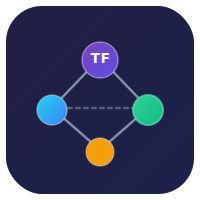

<div align="center">



# Terraform Graph Online

**`terraform graph` 在线可视化系统，实时叠加资源执行状态。**

[](https://www.python.org/)
[](https://fastapi.tiangolo.com/)
[](https://d3js.org/)
[](https://www.terraform.io/)
[](LICENSE)
[](#-参与贡献)
[](#-ai-生成声明)

[English](README.md) · [简体中文](README_CN.md)



</div>

---

## ✨ 项目简介

**Terraform Graph Online** 是一个轻量、可自部署的在线系统：在浏览器中渲染 Terraform 项目的依赖图，并在 `terraform plan` / `apply` 执行过程中**实时叠加每个资源的执行状态**。

系统由两部分组成：

| 组件 | 作用 |
| --- | --- |
| 🖥️ **Server（在线系统）** | FastAPI + WebSocket + 纯静态前端，使用 SQLite 持久化 DOT 图与日志，并通过 WebSocket 把状态变更推送给浏览器。 |
| 🤖 **Agent（执行机端）** | 一个小巧的 Python CLI，安装在 Terraform 执行机上：执行 `terraform graph`、包裹 `terraform` 命令、把 stdout/stderr 实时回传到 Server。 |

整个系统是纯 Python 进程 —— 无需 Docker、无需消息队列、无需云账号。

## 🎯 解决了什么问题

Terraform 的 CLI 输出是**线性**的，但基础设施本质上是一张**图**。当几十个资源并行编排时，纯文本日志很难回答：

- *现在到底是哪个资源在创建？*
- *某个 module 比另一个先完成了吗？*
- *`apply` 失败时，挂在依赖树的哪个节点上？*

这个项目用可视化方式回答这些问题，且**完全不要求 Server 侧持有 `plan`/`apply` 权限** —— 只需要在执行机上能跑 `terraform graph`。

## 🌟 核心特性

- 🌐 **Web 在线可视化** —— 基于 D3 + dagre-d3 的交互式 DAG 图。
- 🔴🟢🟡 **状态实时叠加** —— 资源会按 `queued` / `running` / `complete` / `failed` 着色并实时更新。
- 🧩 **多会话管理** —— 同时管理多个 Terraform 项目/环境。
- 🪶 **零基础设施** —— 单进程 FastAPI + 单文件 SQLite，前后端同端口提供服务。
- 🛡️ **对只读环境友好** —— 在 Server 只能执行 `terraform graph`、只能读日志的环境下也可以工作。
- 💻 **跨平台 Agent** —— 自带 Linux/macOS shell 与 Windows PowerShell 启动器。
- 🔌 **多种采集方式** —— 包裹命令（`watch`）、跟随日志（`tail`）、整体上传（`upload-log`）、镜像整个 shell 会话（`shell`）。

## 🏗️ 系统架构

```
┌────────────────────────────┐         HTTP / WebSocket          ┌────────────────────────────┐
│      Terraform 执行机      │ ───────────────────────────────►  │       Server (FastAPI)     │
│                            │  POST /api/sessions/{sid}/graph   │                            │
│  ┌──────────────────────┐  │  POST /api/sessions/{sid}/logs    │  ┌──────────────────────┐  │
│  │  tfgraph-agent       │  │                                   │  │  parser  (DOT)       │  │
│  │  • graph (DOT)       │  │ ◄─────────────────────────────────┤  │  store   (SQLite)    │  │
│  │  • watch / tail      │  │           WebSocket 推送          │  │  hub     (WS 广播)   │  │
│  │  • upload-log        │  │                                   │  └──────────┬───────────┘  │
│  └──────────────────────┘  │                                   │             │              │
└────────────────────────────┘                                   │             ▼              │
                                                                 │  ┌──────────────────────┐  │
                                                                 │  │  静态前端 SPA         │  │
                                                                 │  │  D3 + dagre-d3       │  │
                                                                 │  └──────────────────────┘  │
                                                                 └────────────────────────────┘
```

- **图来源**：`terraform graph` 输出的 DOT，每个会话解析一次。
- **状态来源**：对控制台输出做正则匹配（`Creating...`、`Creation complete`、`Modifying...`、`Destroying...`、`Apply complete!` 等）。
- **传输链路**：Agent → Server 走 HTTP；Server → 浏览器走 WebSocket。

## 📁 项目结构

```
terraform-graph/
├── server/                     # 在线系统（FastAPI + 静态前端）
│   ├── app.py                  # 后端入口（API + WebSocket）
│   ├── parser.py               # DOT 解析器
│   ├── store.py                # SQLite 存储
│   ├── requirements.txt
│   └── static/                 # 前端（HTML + CSS + JS）
│       ├── index.html
│       ├── style.css
│       └── app.js
├── agent/                      # 执行机 Agent
│   ├── tfgraph_agent.py        # Agent 主程序
│   ├── tfgraph-agent.sh        # POSIX 启动器
│   ├── tfgraph-agent.ps1       # Windows PowerShell 启动器
│   ├── install.sh              # 一键安装脚本（Linux/macOS）
│   ├── install.ps1             # 一键安装脚本（Windows）
│   └── requirements.txt
├── docs/                       # 图标与图片
└── README.md
```

## 📦 下载

预编译的**单文件二进制**通过 [Releases](https://github.com/corningma/terraform-graph/releases/latest) 发布 —— 目标机器**无需安装 Python**。

| 平台 | Server | Agent |
|---|---|---|
| Linux x86_64 | `tfgraph-server-linux-amd64` | `tfgraph-agent-linux-amd64` |
| macOS Intel | `tfgraph-server-darwin-amd64` | `tfgraph-agent-darwin-amd64` |
| macOS Apple 芯片 | `tfgraph-server-darwin-arm64` | `tfgraph-agent-darwin-arm64` |
| Windows x64 | `tfgraph-server-windows-amd64.exe` | `tfgraph-agent-windows-amd64.exe` |

```bash
# Server
curl -fsSL -o tfgraph-server \
  https://github.com/corningma/terraform-graph/releases/latest/download/tfgraph-server-linux-amd64
chmod +x tfgraph-server && ./tfgraph-server

# Agent
curl -fsSL -o tfgraph-agent \
  https://github.com/corningma/terraform-graph/releases/latest/download/tfgraph-agent-linux-amd64
chmod +x tfgraph-agent
TFGRAPH_SERVER=http://<server-ip>:8000 ./tfgraph-agent ping
```

> 想从源码运行？继续阅读开发者部署流程 ↓

## 🚀 快速开始

### 1. 启动在线系统

```bash
cd server
pip install -r requirements.txt
python app.py
# → 默认监听 http://0.0.0.0:8000
```

打开浏览器访问 `http://<server-ip>:8000`。

### 2. 在 Terraform 执行机上安装 Agent

**Linux / macOS**

```bash
curl -O http://<server-ip>:8000/install.sh
bash install.sh http://<server-ip>:8000
```

**Windows（PowerShell）**

```powershell
Invoke-WebRequest http://<server-ip>:8000/install.ps1 -OutFile install.ps1
.\install.ps1 -Server http://<server-ip>:8000
```

或者手动安装：

```bash
cd agent
pip install -r requirements.txt
export TFGRAPH_SERVER=http://<server-ip>:8000
```

### 3. 使用 Agent

```bash
# 联通性检测
tfgraph-agent ping

# 在 terraform 项目目录下，初始化会话并上传依赖图
cd /path/to/your/tf-project
tfgraph-agent graph --name "prod-network"

# 监控 terraform 命令执行（包裹方式，实时捕获 stdout/stderr）
tfgraph-agent watch -- terraform plan
tfgraph-agent watch -- terraform apply

# 若没有 plan/apply 执行权限，可以 tail 现有日志文件
tfgraph-agent tail /path/to/terraform.log

# 上传一份完整日志文件
tfgraph-agent upload-log /path/to/terraform.log
```

## 🧹 卸载

### 停止 Agent（不删数据）

```bash
# 停止后台守护（TF_LOG tail / 命令监控）
tfgraph-agent daemon-stop

# 确认已停止
tfgraph-agent daemon-status
```

### 注销当前会话（同时删除服务端数据）

`logout` 会停止本地 daemon、清理本地 offset/缓存文件，并**删除服务端的会话、依赖图、所有日志**：

```bash
tfgraph-agent logout                              # 当前目录对应的会话
tfgraph-agent logout --sid <session-id>           # 指定会话
tfgraph-agent logout --server http://<srv>:8000   # 指定服务端
```

需要重新使用时执行 `tfgraph-agent init` 即可。

### 完整卸载 Agent

**Linux / macOS** —— 安装脚本自带 `--uninstall`，会自动：

1. 停止 daemon（`tfgraph-agent daemon-stop`）
2. 删除 `~/.tfgraph/`（二进制、脚本、env、状态文件、daemon 文件）
3. 清理 `~/.bashrc`、`~/.zshrc`、`~/.profile` 中的 PATH 与 source 行

```bash
# install.sh 还在本地
bash install.sh --uninstall

# 或从服务端重新拉取脚本执行
curl -fsSL http://<server-ip>:8000/install.sh | bash -s -- --uninstall
```

手动清理（兜底）：

```bash
tfgraph-agent daemon-stop || true
rm -rf ~/.tfgraph
# 再手动从 shell 配置文件中删除 `source ~/.tfgraph/env` 这一行
```

**Windows（PowerShell）**：

```powershell
# 停掉 daemon
tfgraph-agent daemon-stop

# 删除安装目录
Remove-Item -Recurse -Force "$env:USERPROFILE\.tfgraph"

# 从用户级 PATH 中移除 tfgraph 路径（之后新开终端生效）
[Environment]::SetEnvironmentVariable(
  "Path",
  ([Environment]::GetEnvironmentVariable("Path", "User") -split ';' |
    Where-Object { $_ -notmatch '\\.tfgraph\\bin$' }) -join ';',
  "User"
)
```

### 重置 / 清空服务端

要彻底清空服务端的所有会话、依赖图与日志：

```bash
# 1. 先停止 server 进程（systemctl 或 lsof + kill 都可以）

# 2. 删除 SQLite 数据库（这是唯一的持久化状态）
rm -f /path/to/data.db /path/to/data.db-shm /path/to/data.db-wal

# 3. 重启 server，会自动创建空数据库
```

如果只想删某一个会话，可以在浏览器顶栏的 `···` 菜单 → **删除会话**，无需动数据库。

## 🧠 设计要点

- **只依赖 `terraform graph`**：完整依赖图来自 DOT 输出，无需 `plan`/`apply` 权限。
- **状态来自日志匹配**：通过解析控制台输出中 `Creating...`、`Creation complete`、`Modifying...`、`Destroying...`、`Apply complete!` 等关键字推导每个资源的状态。
- **天然实时**：Agent 通过 HTTP POST 上报增量日志行；Server 通过 WebSocket 把状态变更推给浏览器。
- **轻量栈**：后端 FastAPI + SQLite；前端纯静态（CDN 引入 D3 + dagre-d3）。
- **多租户友好**：会话维度隔离，多台执行机、多个项目可以共用一个 Server。

## 🛠️ 命令参考

| 命令 | 用途 |
| --- | --- |
| `tfgraph-agent ping` | 检查与 Server 的联通性 |
| `tfgraph-agent init --name <n>` | 注册/更新会话，但不上传图 |
| `tfgraph-agent graph --name <n>` | 执行 `terraform graph` 并上传 DOT |
| `tfgraph-agent shell` | 进入子 shell 镜像，所有终端输出自动上报 |
| `tfgraph-agent watch -- <cmd...>` | 包裹一条命令，实时上传其输出 |
| `tfgraph-agent tail <log>` | 跟随一个日志文件，实时上传新增行 |
| `tfgraph-agent upload-log <log>` | 一次性上传完整日志文件 |

### 环境变量

| 变量 | 说明 |
| --- | --- |
| `TFGRAPH_SERVER` | 在线系统地址，例如 `http://10.0.0.1:8000` |
| `TFGRAPH_SESSION` | 显式指定会话 ID（不指定则按 `--name` 自动派生） |
| `TFGRAPH_NAME` | 默认会话名（默认取当前目录名） |

## 🤖 AI 生成声明

> **本项目 100% 由 AI 编程助手生成。**
>
> 仓库内的所有文件 —— 包括 Python 源码、FastAPI 服务端、Agent CLI、POSIX/PowerShell
> 启动脚本、前端 HTML/CSS/JS、SVG Logo 与 Banner、以及本份 README —— 均由 AI
> 根据项目作者的自然语言需求生成，**没有任何一行是人工手写的**。
>
> 代码以 MIT License 协议发布，按 **"原样（AS IS）"** 提供，不附带任何形式的担保。
> 在将其用于生产环境或安全敏感场景之前，强烈建议你 **认真 review、测试与审计**
> 全部代码。

## 🤝 参与贡献

欢迎提交 Issue 与 PR！如果你发现 Bug、希望增加其他语言/版本的状态关键字识别，或者对前端有新点子，请先开 Issue 一起讨论。

## 📄 开源协议

基于 [MIT License](LICENSE) 发布。
